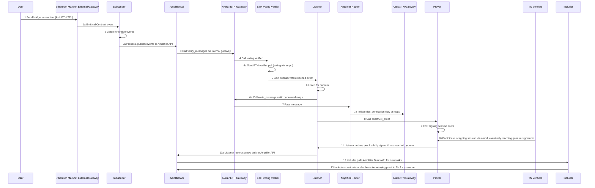

# Telcoin-Network Cross-Chain Bridge Relayers

## Relayer High-Level Flow:

1. user sends bridge tx to eth mainnet gateway causing a `ContractCall` event to be emitted (1a)
2. Subscriber is listening for these events and picks up event 1a, processing it and submitting it to Amplifier API (2a)
3. Axelar internally calls `verify_messages` on Axelar (internal) gateway contract for eth
4. Axelar:eth internal gateway calls voting verifier, which starts ETH verifier voting poll via ampd (4a)
5. once quorum of votes are cast for the message, an event is emitted.
6. another axelar-specific relayer "Listener" listens for this event to call `route_messages` on Axelar:eth gateway (6a)
7. chain’s Axelar gateway passes the message to the Amplifier router, which then passes it on to Axelar:TN gateway (7a)
8. Listener calls `construct_proof` to start the process of creating a signed batch that can be relayed back to eth as well as pass the now-outbound message from the Axelar:TN gateway to the prover.
9. prover starts a signing session with the multisig contract by emitting event
10. noticing the event, TN verifiers participate in the signing session via ampd
11. once quorum signatures are submitted, Listener records a new valid `taskID` to the Amplifier Tasks API (11a)
12. Includer polls Amplifier Tasks API for new valid `tasks`
13. Includer relays new valid `tasks` which contain fully signed proofs (from the prover) to TN to be executed via transactions on TN.

## The Subscriber

### Subscriber spec:

The Subscriber’s job is to guarantee that every protocol event on the Amplifier chain is detected and successfully published to the Amplifier API. The relayer detects outgoing GMP messages from the chain to the AVM and publishes them to the GMP API so that they can be verified, routed, signed, and delivered to the destination chain.

- subscribe to external eth gateway, hooking into onchain events
- filter for `ContractCall(address indexed sender, string destinationChain, string destinationContractAddress, bytes32 indexed payloadHash, bytes payload)`
- ensure target function is `execute(bytes32 commandId, string calldata sourceChain, string calldatasourceAddress, bytes calldata payload)` ?
- publish to amplifier GMP API via `fetch()` & using CallEvent schema, obtain confirmation response

## The Includer

### Includer spec:

The Includer’s job is to guarantee that some payload (termed `task` by Axelar) gets included in a transaction in a block on the Amplifier chain. The relayer receives incoming GMP messages from the AVM to the chain and executes them by writing the transaction payloads to a block on the Amplifier chain.

- poll amplifier Task API for new tasks
- check whether new tasks are already executed (ie by another includer)
- translate task payload into transaction
- sign transaction and publish to TN (via RPC or direct-to-node?)
- monitor transaction & adjust gas params if necessary
- must push latest task ID to some persistent storage as a fallback in the case where the `Includer` goes offline and `taskID` has been consumed at TaskAPI

### Axelar GMP API Endpoints

##### Note: These can only be accessed after obtaining an mTLS authentication cert and instantiating the voting-verifier, internal-gateway, and multisig-prover contracts for Telcoin Network on the Axelar devnet. The path to the mTLS cert and key file must be provided in the `.env` file

#### Events Endpoint

`POST /chains/{chain}/events`
In this endpoint, events are published that indicate completed actions for the cross-chain messaging process. Developers can use this endpoint to submit the completion of new actions (e.g., that an new contract call was made, or a message was approved).

#### Tasks Endpoint

`GET /chains/{chain}/tasks`:
This endpoint returns tasks associated with the cross-chain messaging protocol. Each one of these tasks indicates an operation that needs to take place in order to proceed with the process of a GMP call. Developers can use this endpoint to monitor and react to various tasks (e.g., trigger an execution, or a refund).

### Amplifier-Devnet Contract Deployments

The Amplifier-Devnet AVM contract deployment addresses for Telcoin-Network use the pre-existing implementations and are as follows:

| Name             | Network          | Address                                                           | CodeId |
| ---------------- | ---------------- | ----------------------------------------------------------------- | ------ |
| Voting Verifier  | Amplifier-Devnet | axelar1n2g7xr4wuy4frc0936vtqhgr0fyklc0rxhx7qty5em2m2df47clsxuvtxx | 626    |
| Internal Gateway | Amplifier-Devnet | axelar16zy7kl6nv8zk0racw6nsm6n0yl7h02lz4s9zz4lt8cfl0vxhfp8sqmtqcr | 616    |
| Multisig Prover  | Amplifier-Devnet | axelar162t7mxkcnu7psw7qxlsd4cc5u6ywm399h8xg6qhgseg8nq6qhf6s7q8m0e | 618    |

#### Misc Notes and TODOs:

- verifier == NVV, watches consensus, performs normal validator duties without voting
- use ampd alongside verifierNVV & axelar as intended

todo:

- implement relayer - markus
- verifier spec
  - runs alongside ampd
  - when poll starts ampd calls `RPCFinalizedBlock` -> latestHeightAndHash on the verifierNVV
  - vote on multisig prover (investigate possible changes)
  - how many? third parties
- deploy contracts - markus
